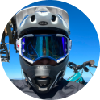

### Getúlio Strapazzon

Bicycle rider and software engineer specializing in product development, my main objective is to craft innovative software.

#### Languages

#### Technologies

#### Mobile Frameworks

### Social Networks

 

| Github stats                                                                                                                                                                                                                                                     | Top langs                                                                                                                                                                                                                                                      |
| ---------------------------------------------------------------------------------------------------------------------------------------------------------------------------------------------------------------------------------------------------------------- | -------------------------------------------------------------------------------------------------------------------------------------------------------------------------------------------------------------------------------------------------------------- |
|  |  |
